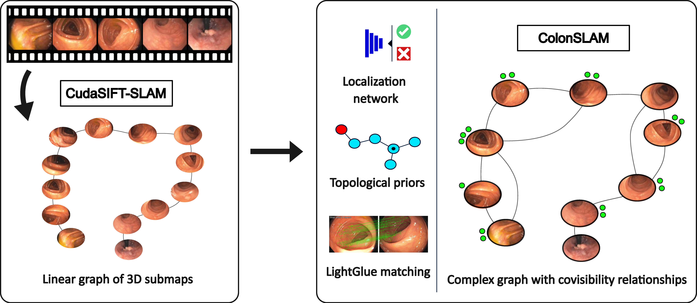

# ColonSLAM: Metric-Topological SLAM for colonoscopy

ColonSLAM is a metric-topological SLAM algorithm able to build a topological graph starting from the metric submaps built by CudaSIFT-SLAM. Additionally, it can localize a second sequence of the same patient against the previously built topological map. 

<p align="center">
  <a></a>
</p>

## Installation

To install the ColonSLAM environment, simply use conda as:

``` bash
conda env create -f environment.yml
```
**Additionally:** Run the following command to install *googledrivedownloader*, *einops*, *opencv*, and *matplotlib*
```python
pip install git+https://github.com/ndrplz/google-drive-downloader.git
pip install einops
pip install opencv-python
pip install matplotlib
```

---
## Additional Setup (Important)

Before running the SLAM pipeline, ensure the following auxiliary files are in place:

1. **TimeSformer Configuration**  
   Retrieve the `TimeSformer_divST_8x32_224.yaml` file and place it in `vg_networks/endofm/data/`:
   ```bash
   cd ./ColonSLAM/vg_networks/endofm
   mkdir -p data
   wget https://raw.githubusercontent.com/med-air/Endo-FM/main/models/configs/Kinetics/TimeSformer_divST_8x32_224.yaml \
        -O vg_networks/endofm/data/TimeSformer_divST_8x32_224.yaml
   ```

2. **Pre-trained Endo-FM Weights**
   Download the endo_fm.pth checkpoint from the link provided in [Endo-FM repo](https://github.com/med-air/Endo-FM) and save it alongside the configuration:
   ```bash
   ./ColonSLAM/vg_networks/endofm/data/endo_fm.pth
   ```

## Download trained models and evaluation data

First, download the trained models, which can be found [here](https://unizares-my.sharepoint.com/:f:/g/personal/684222_unizar_es/Eh5a668vyadJiotwQEl-LK0BVzlnIKUv8jYFBstzaQORYg?e=JAToB6). 

The images used for evaluation can be found [here](https://unizares-my.sharepoint.com/:f:/g/personal/684222_unizar_es/EmsMj__CHPVEpMdbCF9yaUABHwE2mKaJkvRLf7H6EfBUKw?e=MpDtzl).

Save the downloaded models and datasets in the following directory structure
```bash
./ColonSLAM
├── checkpoints
│   ├── endofm_cls_0_0_224_schedule_resize_none
│   │   └── best_model.pth
│   ├── resnet18_netvlad_64_0_1_resize_none
│   │   └── best_model.pth
│   └── … (other experiment folders)
├── assets
│   └── noimages.jpg
├── topometric
│   └── topometric
│       ├── 027
│       ├── 035
│       ├── reuse
│       ├── 027.png
│       ├── 027.txt
│       ├── 035.png
│       ├── 035.txt
│       └── … (other sequence folders and files)
└── other folders and files

```


## Usage

To run the topological SLAM run the following command:

```bash
cd ColonSLAM
python slam.py --resume=[PATH_TO_MODELS]/endofm_cls_0_0_224_schedule_resize_none/best_model.pth --use_lightglue --experiment_name=colonslam --sim_threshold=0.95 --use_mlp --matches_threshold=100 --window_size=5 --voting_threshold=0.20 --filter
```

To run the map reuse experiment, run the following command:

```bash
cd ColonSLAM
python slam_reuse.py --resume=[PATH_TO_MODELS]/endofm_cls_0_0_224_schedule_resize_none/best_model.pth --experiment_name=colonslam-reuse --sim_threshold=0.80 --use_mlp --mode=slam --voting_threshold=0.15 --sequence_map 027 --start_processing 34 --sequence_loc 035 --window_size=5 --filter 
```

## Related Publications:
Javier Morlana, Juan D. Tardós J.M.M. Montiel, **Topological SLAM in colonoscopies leveraging deep features and topological priors**, *MICCAI 2024*. [PDF](https://arxiv.org/abs/2409.16806)

```
@inproceedings{morlana2024topological,
  title={Topological SLAM in colonoscopies leveraging deep features and topological priors},
  author={Morlana, Javier and Tard{\'o}s, Juan D and Montiel, Jos{\'e} MM},
  booktitle={International Conference on Medical Image Computing and Computer-Assisted Intervention},
  pages={733--743},
  year={2024},
  organization={Springer}
}
```
